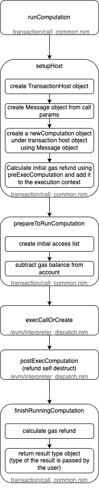

# EVM

### Entrypoint

To use the EVM within the nimbus execution client one would most probably use `txCallEvm`, `rpcCallEvm` or `rpcEstimateGas`. 

- `txCaEvm` is used for processing blocks in the current nimbus EL client (/core/executor/process_transaction.nim:117). 
- `rpcCallEvm` is used for serving `eth_call` requests and creating access lists for `eth_createAccessList` requests
- `rpcEstimateGas` is used for serving `eth_estimateGas` requests

All three methods(/transaction/call_evm.nim) call the `runComputation` method to execute the EVM, hence, `runComputation` becomes the entrypoint of the EVM. 

### `runComputation`

File: /transaction/call_common.nim

### `execCallOrCreate`

File: /evm/interpreter_dispatch.nim
