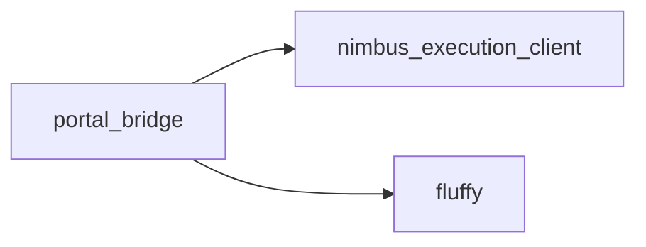
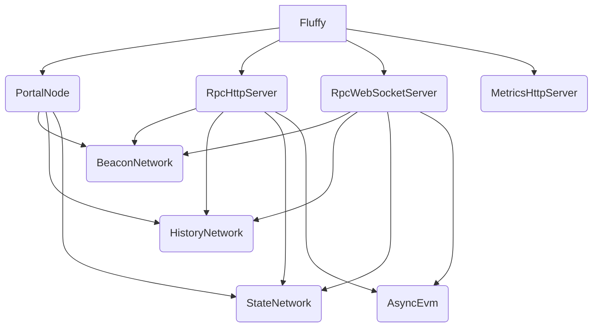
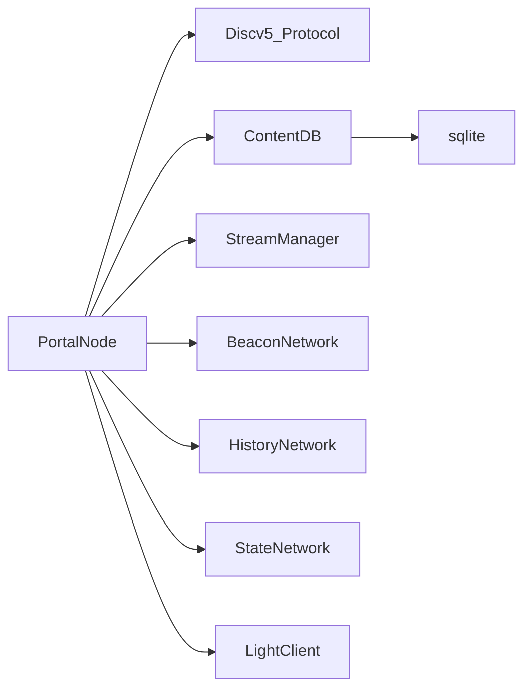
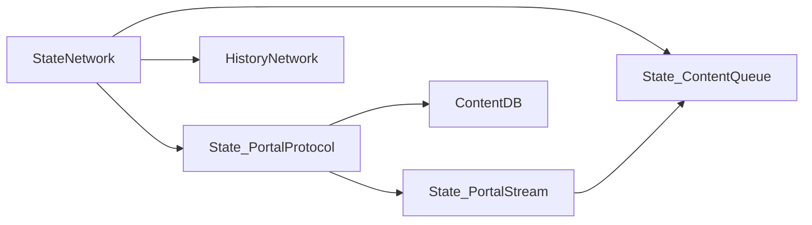
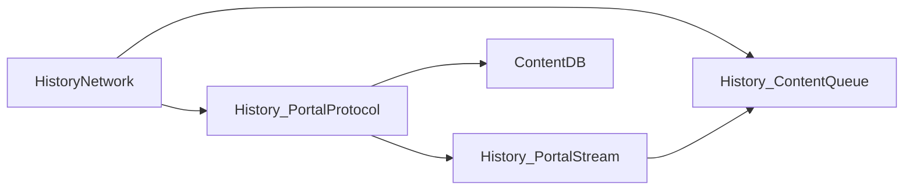
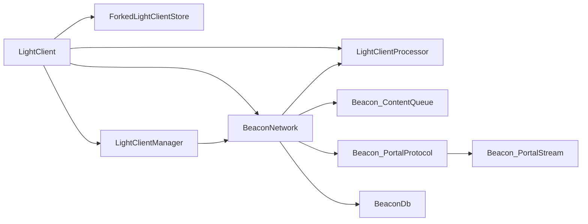
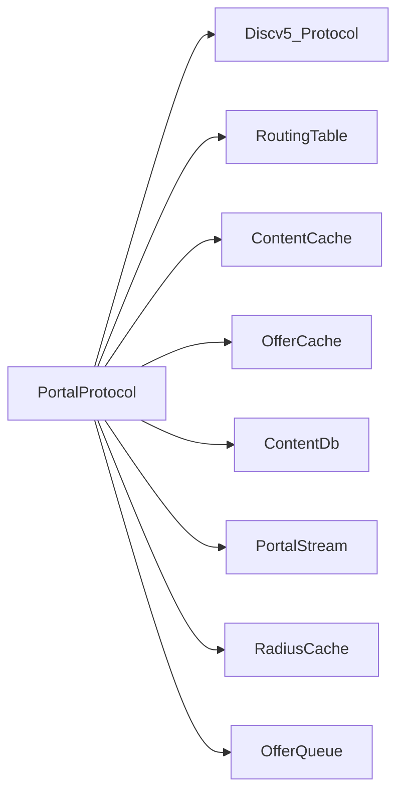
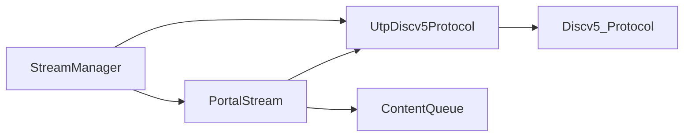
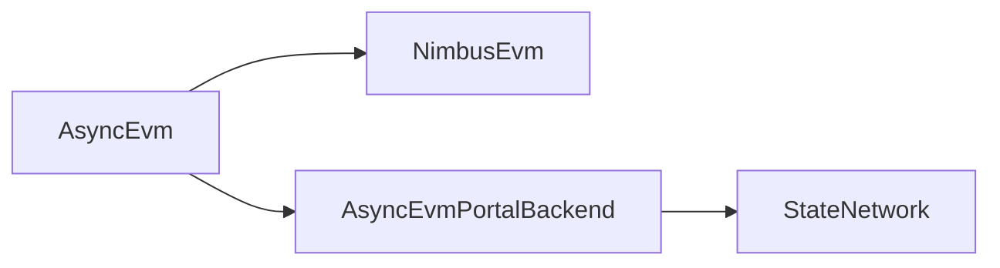

# Fluffy Architecture

The following diagram outlines the Fluffy high-level architecture.

## Fluffy Components

## Portal Node Components

## State Network Components

## History Network Components

## Beacon Network Components

## Portal Protocol Components

## Stream Manager Components

## Async Evm Components

