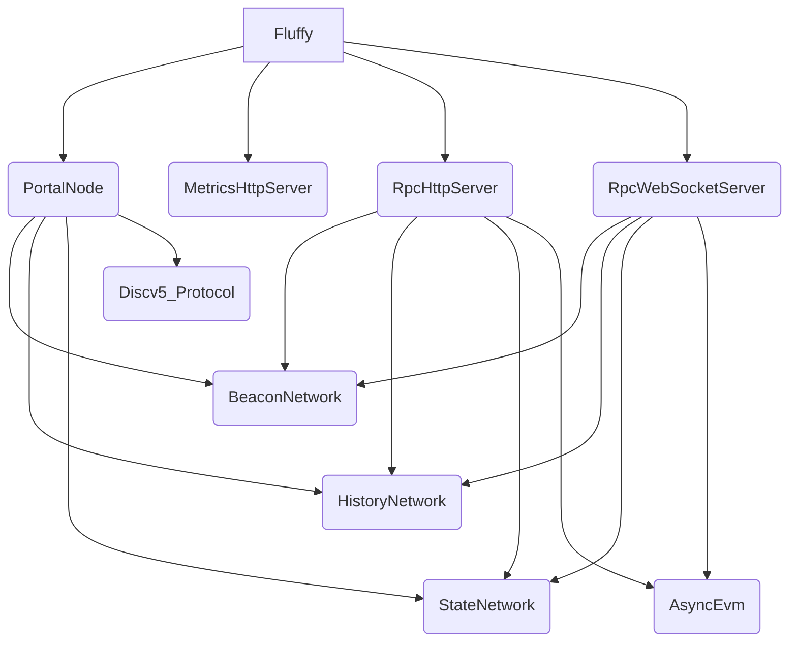
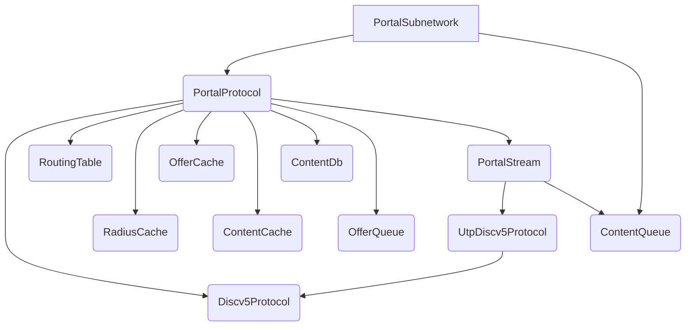
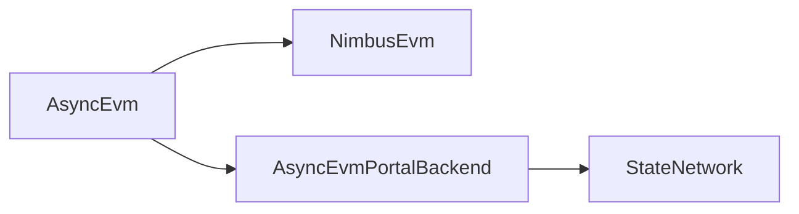

# Fluffy Architecture

This diagram outlines the Fluffy high-level architecture. The arrows indicate a dependancy relationship between each component. 

```mermaid

graph TD;
    Fluffy ---> id2(PortalNode) & id5(MetricsHttpServer)
    Fluffy ---> id3(RpcHttpServer) & id4(RpcWebSocketServer)
    id3(RpcHttpServer) & id4(RpcWebSocketServer) & id2(PortalNode) ---> id7(BeaconNetwork)
    id3(RpcHttpServer) & id4(RpcWebSocketServer) & id2(PortalNode) ----> id8(HistoryNetwork)
    id3(RpcHttpServer) & id4(RpcWebSocketServer) & id2(PortalNode) -----> id9(StateNetwork)
    id3(RpcHttpServer) & id4(RpcWebSocketServer) -----> id6(AsyncEvm)
    id2(PortalNode) --> id10(Discv5_Protocol)
```

## Portal Subnetworks

```mermaid

graph TD;
    PortalSubnetwork --> id1(PortalProtocol)
    PortalSubnetwork --> id2(ContentQueue)
    id1(PortalProtocol) --> id3(Discv5Protocol)
    id1(PortalProtocol) --> id4(RoutingTable)
    id1(PortalProtocol) ---> id5(RadiusCache)
    id1(PortalProtocol) --> id6(OfferCache)
    id1(PortalProtocol) ---> id7(ContentCache)
    id1(PortalProtocol) --> id8(ContentDb)
    id1(PortalProtocol) ---> id9(OfferQueue)
    id1(PortalProtocol) --> id10(PortalStream)
    id10(PortalStream) --> id11(UtpDiscv5Protocol)
    id10(PortalStream) --> id2(ContentQueue)
    id11(UtpDiscv5Protocol) --> id3(Discv5Protocol)
```

## Async Evm

```mermaid

graph LR
  AsyncEvm --> NimbusEvm
  AsyncEvm --> AsyncEvmPortalBackend
  AsyncEvmPortalBackend --> StateNetwork

```
