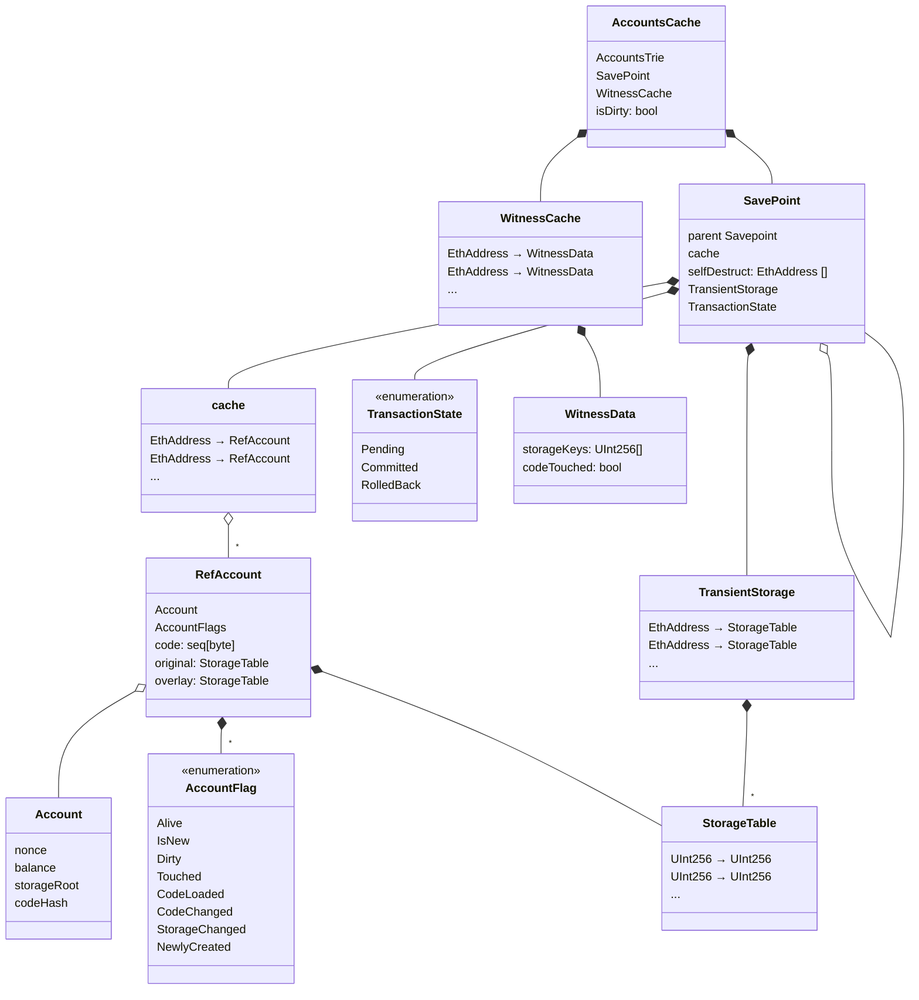

`accounts_cache.nim` class diagram
==================================

<!-- To edit live in VSCode, download the Markdown Preview Mermaid Support extension -->

The file `accounts_cache.nim` has been relocated
================================================

Background
----------

The new *LedgerRef* module unifies different implementations of the
*accounts_cache*. It is intended to be used as new base method for all of the
*AccountsCache* implementations. Only constructors differ, depending on the
implementation.

This was needed to accomodate for different *CoreDb* API paradigms. While the
overloaded legacy *AccountsCache* implementation is just a closure based
wrapper around the *accounts_cache* module, the overloaded *AccountsLedgerRef*
is a closure based wrapper around the *accounts_ledger* module with the new
*CoreDb* API returning *Result[]* values and saparating the meaning of trie
root hash and trie root reference.

This allows to use the legacy hexary database (with the new *CoreDb* API) as
well as the *Aristo* database (only supported on new API.)

Instructions
------------

| **Legacy notation**    | **LedgerRef replacement**     | **Comment**
|:-----------------------|:------------------------------|----------------------
|                        |                               |
| import accounts_cache  | import ledger                 | preferred method,
| AccountsCache.init(..) | AccountsCache.init(..)        | wraps *AccountsCache*
|                        |                               | methods
|                        | *or*                          |
|                        |                               |
|                        | import ledger/accounts_cache  | stay with legacy
|                        | AccountsCache.init(..)        |  version of
|                        |                               | *AccountsCache*
| --                     |                               |
| fn(ac: AccountsCache)  | fn(ac: LedgerRef)             | function example for
|                        |                               | preferred wrapper
|                        | *or*                          | method
|                        |                               |
|                        | fn(ac: AccountsCache)         | with legacy version,
|                        |                               | no change here

### The constructor decides which *CoreDb* API is to be used

| **Legacy API constructor**     | **new API Constructor**            |
|:-------------------------------|:-----------------------------------|
|                                |                                    |
| import ledger                  | import ledger                      |
| let w = AccountsCache.init(..) | let w = AccountsLedgerRef.init(..) |
|                                |                                    |
