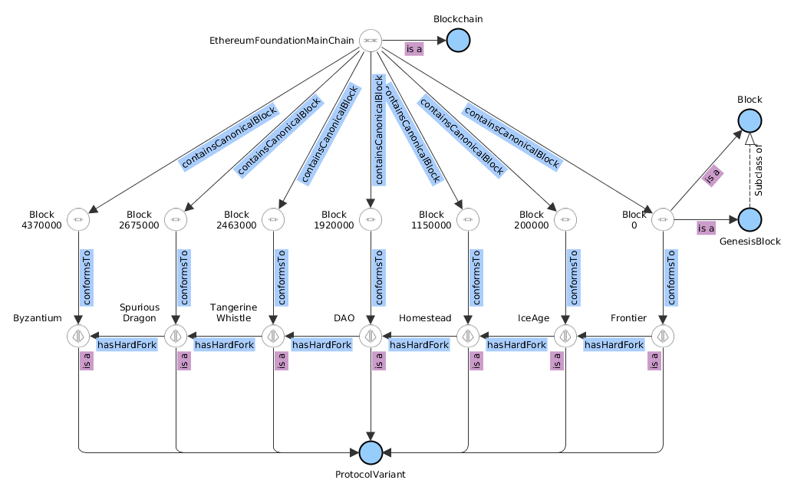

# List of Ethereum hard forks with VM impact.

From https://www.etherchain.org/hardForks

| Name                        | On Roadmap   | Date                | Block   |
| --------------------------- | ------------ | ------------------- | ------- |
| Frontier                    | Yes          | 30/07/2015 19:26:28 | 1       |
| Frontier Thawing            | Yes          | 08/09/2015 01:33:09 | 200000  |
| Homestead                   | Yes          | 14/03/2016 20:49:53 | 1150000 |
| DAO Fork                    | No           | 20/07/2016 17:20:40 | 1920000 |
| Tangerine Whistle (EIP-150) | No           | 18/10/2016 17:19:31 | 2463000 |
| Spurious Dragon             | No           | 22/11/2016 18:15:44 | 2675000 |
| Byzantium                   | Yes          | 16/10/2017 09:22:11 | 4370000 |

From https://ethereum.stackexchange.com/a/28409

Tangerine Whistles introduced new gas costs

Byzantium introduced opcodes:
  - REVERT (EIP 140)
  - RETURNDATASIZE and RETURNDATACOPY (EIP 211)
  - STATICCALL (EIP 214)
