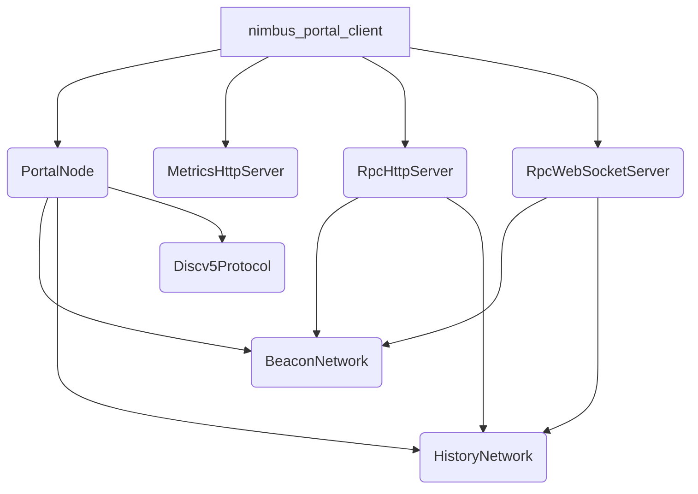
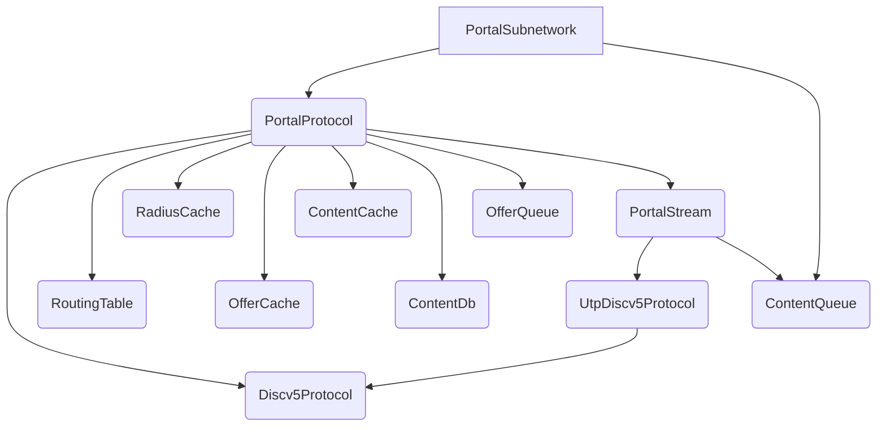

# Nimbus Portal Client Architecture

This section outlines the Nimbus Portal client's architecture and shows the main components in the codebase. The arrows indicate a dependancy relationship between each component.

## Nimbus Portal client high level architecture

This diagram outlines the Nimbus Portal client high-level architecture.

When the Nimbus Portal client starts it runs an instance of `PortalNode` which manages the `Discv5Protocol`, `BeaconNetwork` and `HistoryNetwork` instances. There is a single instance of each of these components and each of the subnetwork instances can be enabled/disabled depending on the startup configuration selected. The `PortalNode` instance includes everything needed to participate in the Portal network to enable storage of offered content and serving content requests from other Portal nodes. It may become part of a library in the future which would allow other projects to easily embed an instance of the Nimbus Portal client in their codebase.

The `RpcHttpServer` and `RpcWebSocketServer` enable serving JSON-RPC requests from Portal network over HTTP and WebSocket respectively.

## Portal subnetworks

This diagram outlines the generic architecture of each Portal subnetwork.

There are some differences between each of the subnetworks but the components used in each are mostly the same.
Only the `Discv5Protocol` and `ContentDb` instances are shared between the Portal subnetworks while the other components
have separate instances per subnetwork.

The `Discv5Protocol` type implements the Discv5 protocol which is used as a transport to send messages between
Portal nodes. Each Portal subnetwork (such as the `BeaconNetwork` and `HistoryNetwork`) holds an instance of
`PortalProtocol` which implements the Portal Wire protocol and an instance of `ContentQueue` which receives Portal
content from the `PortalStream` when the node receives content from peers. When a content transfer is
initiated which is bigger than the max Discv5 message size, then the `PortalStream` transfers the content using
the `UtpDiscv5Protocol` type which implements uTP on top of Discv5.

The `RoutingTable` implements a Kademlia based DHT which holds the peer ENRs which the Portal node discovers while participating
in each of the Portal Wire subprotocols. The `RadiusCache` holds the last known radius for each peer which is collected
when pinging each node in the routing table periodically. The `OfferCache` caches the content ids of the most recent content successfully offered and stored so that the Portal node can reject content that it already has without doing a database lookup. The `ContentCache` improves the performance of content lookups (used by the JSON-RPC API's) by caching the most recently fetched
content in a LRU cache.

The `ContentDb` is the main database in the Nimbus Portal client which internally uses sqlite to store the content data on disk. The `PortalProtocol`
uses the `OfferQueue` to hold pending offer requests which are passed to the `PortalStream` by the concurrent offer workers
which run as a part of `PortalProtocol`.
