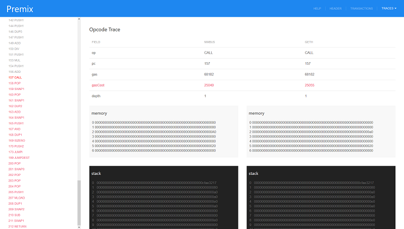

# Premix

> Premix was **pre**mium(subsidized gasoline)   **mix**ed [with lubricant oil]
used for two stroke internal combustion engines and it tends to produce a lot
of smoke.

Today premix is a block validation debugging tool targeting at nimbus ethereum
client. Premix will query transaction execution steps from other ethereum
clients and compare it with nimbus'.

Premix then will produce a web page to present comparison result that can be
inspected by developer to pinpoint where the faulty instruction located.

Premix will also produce a test case for the specific problematic transaction
complete with snapshot database to execute transaction validation in isolation.
This test case then can be integrated with nimbus project test suite.



## Requirements
Before you start to use premix debugging tool there are several things you need to prepare.
The first one is you need to install `geth` from [source](https://github.com/ethereum/go-ethereum/releases)
or [binary](https://ethereum.github.io/go-ethereum/downloads/). Minimum required geth version is 1.8.18.
Then you can run it with this command:

```bash
geth --rpc --rpcapi eth,debug --syncmode full --gcmode=archive
```

You need to run it until it synced past the problematic block you want to debug.
After that you can stop it by pressing `CTRL-C` and rerun it with additional
flags `--maxpeers 0` if you want it to stop syncing or let it run as is if you want keep syncing.

The next requirement is you should build Nimbus and Premix with latest dependencies:

```bash
nim c nimbus/nimbus
nim c premix/premix
```

After you successfully build nimbus and premix, you can run nimbus with this command.

```bash
nimbus --prune:archive
```

Nimbus will try to sync up to problematic block then it will stop and execute Premix.
Premix then will launch browser to display a report page. If premix failed to open your default browser,
you can see the report page by opening `premix/index.html`.

In the browser, you can try to navigate tracing result and find where the problem/bug is.

## Tools

* Premix

`Premix` is the main tool in this tool set. It produce data that can be viewed with browser and
debug data that can be consumed by `debug` tool. `Premix` consume data produced either by `nimbus`, `persist`, or `dumper`.
You can run `Premix` manually using this command: `premix debugxxx.json`

* Persist

Because nimbus p2p layer still contains bugs, you may become impatient when try to syncing blocks.
In `/premix` directory, you can find a `persist.nim` tool.
It will help you to sync relatively quicker because it will bypass p2p layer and download blocks from `geth` via `rpc-api`.

When it encounter problematic block during syncing, it will stop and produce debugging data like nimbus does.

```bash
nim c -r premix/persist [--dataDir:your_database_directory] [--head: blockNumber] [--maxBlocks: number] [--numCommits: number]
```

* Debug

Premix debugging tool also produce a set of debugging meta data that you can use to quickly
find the bug without the need to run p2p layer or any other unnecessary code.
In `/premix` directory you'll find `debug.nim` tool that you can use to execute
this debug meta data and you'll only need to work with one block and one transaction
at a time instead of multiple confusing blocks or transactions.

```bash
nim c -r premix/debug blockxxx.json
```

`blockxxx.json` contains database snapshot needed to debug a single block produced by Premix tool.

* Dumper

`Dumper` was designed specifically to produce debugging data that can be further processed by `Premix` from
information already stored in database. It will create a single block tracing information if the block already persisted.
If you want to produce problematic block debug data, better to use `Persist` tool. `Dumper` produced data
usually used to debug features of `Premix` and it's report page logic.

```bash
usage: dumper [--datadir:your_path] --head:blockNumber
```
